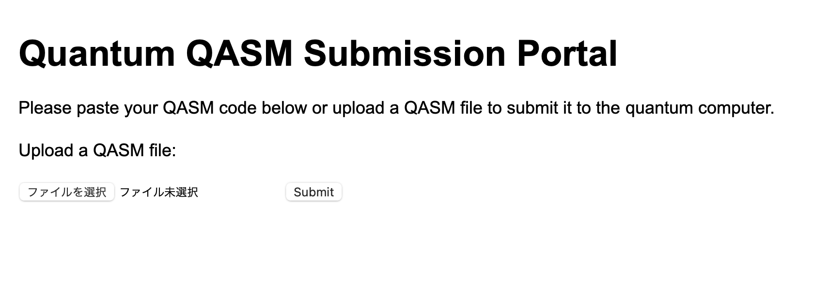

# qbraid-flask-app
An example qbraid flask app using the qbraid provider to submit QASM files to a quantum computer or simulator

To explore more about qBraid and how you can write with qiskit, cirq, pyquil, qasm, pytket, qasm2/3 and convert your circuits and submit to one of our quantum computers please view our [qBraid Lab Demos](https://github.com/qbraid/qbraid-lab-demo)



## Getting started
To get started please first create a virtualenv or conda environment and install the requirements.txt

```
conda create -n qb_flask python=3.9
conda activate qb_flask
```

### Clone the repo and install requirements

```
git clone https://github.com/rryoung98/qbraid-flask-app
cd qbraid-flask-app

pip install -r requirements.txt
```

### Configure your qbraid CLI
In your terminal run, you will be asked to add your api key
```
qbraid configure
```
See the Local Account Setup section to get your access key.

```
qbraid jobs enable braket
```

Initialize the app and visit http://127.0.0.1:5000

```
python application/app.py

>>> * Serving Flask app 'app'
>>> * Debug mode: on
>>> INFO:werkzeug:WARNING: This is a development server. Do not use it in a production deployment. Use a production WSGI server instead.
>>> * Running on http://127.0.0.1:5000
>>> INFO:werkzeug:Press CTRL+C to quit
>>> INFO:werkzeug: * Restarting with stat
>>> * Debugger is active!
>>> * Debugger PIN: 113-807-586
```

You're all set! Now you can submit qasm files to an SV1 simulator

## Local account setup


To use the qBraid-SDK locally (outside of qBraid Lab), you must add your account
credentials:

1. Create a qBraid account or log in to your existing account by visiting
   [account.qbraid.com](https://account.qbraid.com/)
2. Copy your API Key token from the left side of
    your [account page](https://account.qbraid.com/):

3. Save your API key from step 2 by calling
   `QbraidSession.save_config()`:

```python
from qbraid_core import QbraidSession

session = QbraidSession(api_key='API_KEY')
session.save_config()
```

The command above stores your credentials locally in a configuration file `~/.qbraid/qbraidrc`,
where `~` corresponds to your home (`$HOME`) directory. Once saved, you can then connect to the
qBraid API and leverage functions such as `get_devices()` and `get_jobs()`.

### Load Account from Environment Variables

Alternatively, the qBraid-SDK can discover credentials from environment
variables:

```shell
export QBRAID_API_KEY='QBRAID_API_KEY'
```

Then instantiate the session without any arguments

```python
from qbraid_core import QbraidSession

session = QbraidSession()
```

## Launch on qBraid

The "Launch on qBraid" button (below) can be added to any public GitHub
repository. Clicking on it automaically opens qBraid Lab, and performs a
`git clone` of the project repo into your account's home directory. Copy the
code below, and replace `YOUR-USERNAME` and `YOUR-REPOSITORY` with your GitHub
info.

[](https://account.qbraid.com?gitHubUrl=https://github.com/qBraid/qBraid.git)

Use the badge in your project's `README.md`:

```markdown
[](https://account.qbraid.com?gitHubUrl=https://github.com/YOUR-USERNAME/YOUR-REPOSITORY.git)
```

Use the badge in your project's `README.rst`:

```rst
.. image:: https://qbraid-static.s3.amazonaws.com/logos/Launch_on_qBraid_white.png
    :target: https://account.qbraid.com?gitHubUrl=https://github.com/YOUR-USERNAME/YOUR-REPOSITORY.git
    :width: 150px
```

## Contributing

- Interested in contributing code, or making a PR? See
  [CONTRIBUTING.md](CONTRIBUTING.md)
- For feature requests and bug reports:
  [Submit an issue](https://github.com/qBraid/qBraid/issues)
- For discussions, and specific questions about the qBraid-SDK [join our discord community](https://discord.gg/TPBU2sa8Et)
- For questions that are more suited for a forum, post to
  [Quantum Computing Stack Exchange](https://quantumcomputing.stackexchange.com/)
  with the [`qbraid`](https://quantumcomputing.stackexchange.com/questions/tagged/qbraid) tag.
